  

<h1 align="center">Fetchrail</h1>

  A download manager for Windows and Linux. It splits each file across parallel connections, 
  resumes exactly where it stopped, and picks up downloads straight from your browser.

  
  
  

  <a href="https://github.com/Beelzebub2/fetchrail/releases/latest"><strong>Download</strong></a> ·
  <a href="https://fetchrail.rrmtools.uk">Website</a> ·
  <a href="#documentation">Documentation</a> ·
  <a href="https://github.com/Beelzebub2/fetchrail/issues">Report an issue</a>

> Most downloads travel down a single connection. Fetchrail opens up to thirty-two, and lets you watch every one.

## The engine

**Split on the way down. Whole when it lands.**

| | Step | What happens |
| :-: | :-- | :-- |
| `01` | **Probe** | Before any bytes move, Fetchrail asks the server how long the file is and whether it honours byte ranges. |
| `02` | **Split** | The file is cut into segments that never overlap, one per connection. The count adapts to the file and the server, up to 32. |
| `03` | **Fetch** | Segments download side by side. If one drops, only that segment retries from its saved offset while the others keep going. |
| `04` | **Join** | Parts are merged into a temporary file and renamed only when every byte is present. A half-finished file never takes the final name. |

Every download shows its speed, time remaining and the progress of each connection. If a server ignores byte ranges, Fetchrail drops the segmented attempt and fetches the file as a single stream instead.

## Resume that checks before it trusts

- **Pause** closes the connections and frees the download slot.
- **Closed mid-transfer?** The download comes back paused the next time Fetchrail starts.
- **Resume** reuses saved parts only when the file's length, range layout and ETag or Last-Modified still match. Anything else restarts cleanly.

## Decide when, where and how fast

| Control | What it does |
| :-- | :-- |
| **URL batches** | Paste several links, one per line. A batch shares its folder, queue, start time and per-file limit, and rejected links stay in the form to fix. |
| **Speed limits** | One limit for everything and another per file, both adjustable while a download runs. Zero means unlimited. |
| **Queues and schedules** | Give a queue a start time and an optional stop time. At the stop time, transfers return to the queue with their partial bytes intact. |
| **File categories** | Files sort into folders by type. Change the extensions and destinations, or add categories of your own. |

## Torrents on the same rails

Add a magnet link or a `.torrent` file, choose the files you want, and manage it alongside your HTTP downloads. File priorities, peers, trackers, fast resume and seeding goals share the same queues and global download limit. [See the torrent guide](docs/usage.md#torrents-and-magnets).

## Your browser hands over the download

The companion works in Chrome, Edge, Chromium, Vivaldi, Brave and Firefox. It sends downloads to Fetchrail, and gives them back to the browser if the handoff fails.

1. **A download starts in your browser.** Click a file the way you always do. The companion notices it begin.
2. **The companion pauses it and asks Fetchrail.** Fetchrail makes its own request and compares the size and content type with what the browser saw.
3. **Fetchrail takes over.** The browser's copy is cancelled only after Fetchrail has accepted the file. If anything fails along the way, the browser carries on as if nothing happened.

And it does more than catch:

- **Picks from the page.** Scan the current page for links and media, search and filter them, then send only the ones you want.
- **Works through download pages.** For sites with countdowns, it opens each page in turn, follows a single clear download button and captures the final file. Logins and CAPTCHAs stay with you.
- **One right-click away.** Choose **Download with Fetchrail** on any link, or control running transfers from the toolbar.

The companion ships inside Fetchrail and is loaded as an unpacked extension for now. [Read the companion guide](browser-extension/README.md).

## Make it yours

  
  
  
  

Two themes, four accents. Fetchrail uses the system tray when your desktop supports it. Windows installations and writable Linux AppImages use signed updates; native Linux packages update through their package manager.

## Install

**Three steps to the first download.**

1. Choose your system's build from the [latest release](https://github.com/Beelzebub2/fetchrail/releases/latest). For Linux package availability and source builds, see the [Linux guide](docs/linux.md).
2. Run Windows setup or install your Linux package, then launch Fetchrail.
3. Paste an HTTP or HTTPS file link, pick a destination and start.

| Platform | What to know |
| :-- | :-- |
| **Windows x64** | `Fetchrail-Setup-vVERSION-windows-x64.exe`. Setup installs for your account without an administrator prompt and needs the Microsoft Edge WebView2 Runtime. |
| **Linux x64 / ARM64** | Packaging targets `.deb`, `.rpm`, AppImage, native archives and an Arch PKGBUILD. Check the [Linux guide](docs/linux.md) and [qualification matrix](docs/linux-support-matrix.md) for available builds and current coverage. |

Linux package availability follows the published release inventory. The guide includes source builds, and the qualification matrix records tested distro and CPU combinations.

Existing Braid installations retain their history, queues, settings, and partial downloads.

## Documentation

- [User guide](docs/usage.md) — downloads, speed limits, schedules, updates, and removal.
- [Browser companion](browser-extension/README.md) — setup, download capture, page batches, and troubleshooting.
- [Development](docs/development.md) — build from source, tests, packaging, and releases. Built with Rust, Tauri, and React.
- [Architecture](docs/architecture.md) — the transfer engine, persistent state, and browser bridge.
- [Roadmap](docs/roadmap.md) — current gaps and planned improvements.
- [Linux guide](docs/linux.md) — packages, desktop/browser integration and source builds; [qualification matrix](docs/linux-support-matrix.md) and [support plan](docs/linux-support-plan.md).
- [Torrent plan](docs/torrent-plan.md) and [validation](docs/torrent-validation.md) — delivered features, reproducible tests and measured performance.
- [Download engine integration](docs/download-engine-integration.md) — recovery safeguards and measured completion performance.
- [Update feed](docs/update-feed.md) — release notifications, website/app detection, signature checks and repair.

To report a problem, [open an issue](https://github.com/Beelzebub2/fetchrail/issues) with your Fetchrail version, operating system, browser if relevant, steps to reproduce, and the error shown by the app. Remove private URLs or credentials from anything you share.

  <strong>Put your downloads on rails.</strong> 
  <a href="https://github.com/Beelzebub2/fetchrail/releases/latest">Download Fetchrail</a>

