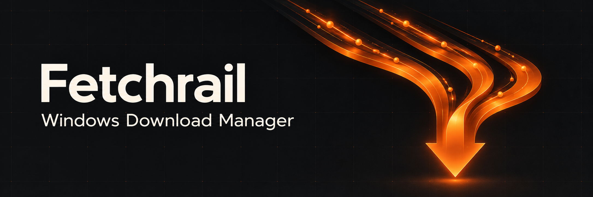

  

<h1 align="center">Fetchrail</h1>

  A download manager with parallel transfers, reliable resume, and a browser companion. Windows releases and Linux support under qualification.

  
  

  <a href="https://github.com/Beelzebub2/fetchrail/releases/latest"><strong>Download for Windows</strong></a> ·
  <a href="#documentation">Documentation</a> ·
  <a href="https://github.com/Beelzebub2/fetchrail/issues">Report an issue</a>

## Features

- **Fast transfers:** up to 32 connections per download, adaptive ranges, and reliable pause/resume.
- **Native torrents:** magnets and `.torrent` files, selected files and priorities, peers/trackers, fast resume and seeding goals in the unified transfer list.
- **Live progress:** speed, time remaining, and individual connection details.
- **Download controls:** URL batches, global and per-file speed limits, queues, schedules, and file categories.
- **Browser integration:** capture files, select page links and media, and work through download pages in Chromium browsers and Firefox.
- **Desktop convenience:** dark and light themes, four accents, a system tray, and signed automatic updates.

## Install

1. Download `Fetchrail-Setup-vVERSION-windows-x64.exe` from the [latest release](https://github.com/Beelzebub2/fetchrail/releases/latest) and run it.
2. Choose your installation folder and shortcuts, then launch Fetchrail.
3. Paste an HTTP(S) file URL, choose a destination, and start downloading.

Setup installs for your Windows account without an administrator prompt. Requires **Windows x64** and **Microsoft Edge WebView2 Runtime**.

Existing Braid installations retain their history, queues, settings, and partial downloads.

Linux packaging targets Ubuntu/Mint/Kali/Debian (`.deb`), Fedora (`.rpm`), Arch (binary PKGBUILD), and wider glibc desktops (AppImage/native archive), on x86_64 and aarch64. Ubuntu 22.04 x64 builds, automated X11/Wayland controls and package checks pass. Installed-app HTTP/torrent/extension and native X11/Wayland checks also pass in Fedora 44, Mint 22.3, Kali 2026.2 and current Arch userspaces on the WSL2 kernel. Full distro certification and ARM64 execution remain pending. See the [Linux guide](docs/linux.md) and [support matrix](docs/linux-support-matrix.md) for build/install instructions and current limits.

## Documentation

- [User guide](docs/usage.md) — downloads, speed limits, schedules, updates, and removal.
- [Browser companion](browser-extension/README.md) — setup, download capture, page batches, and troubleshooting.
- [Development](docs/development.md) — build from source, tests, packaging, and releases. Built with Rust, Tauri, and React.
- [Architecture](docs/architecture.md) — the transfer engine, persistent state, and browser bridge.
- [Roadmap](docs/roadmap.md) — current gaps and planned improvements.
- [Torrent plan](docs/torrent-plan.md) — engine research, UI, client features, and delivery stages.
- [Torrent validation](docs/torrent-validation.md) — implemented features, reproducible tests and measured performance.
- [Linux support plan](docs/linux-support-plan.md) — distro coverage, feature parity, packaging, performance, and Windows regression gates.
- [Linux guide and qualification](docs/linux.md) — packages, desktop/browser integration, source builds and evidence.
- [Download engine integration](docs/download-engine-integration.md) — contributor review, recovery safeguards and measured completion performance.

To report a problem, [open an issue](https://github.com/Beelzebub2/fetchrail/issues) with your Fetchrail version, browser if relevant, steps to reproduce, and the error shown by the app. Remove private URLs or credentials from anything you share.
