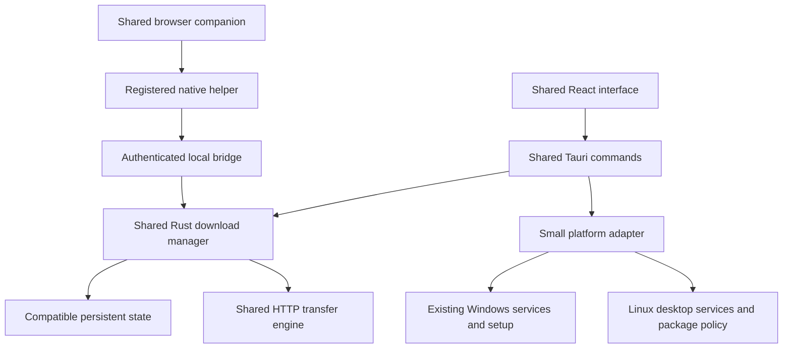

# Fetchrail Linux support plan

[← Back to the README](../README.md)

Research date: 9 October 2026. Application baseline: Fetchrail 0.5.2, including the native torrent integration in the working tree. Core Linux adapters, native packaging/release gates and shared-engine recovery/resource checks are implemented. Ubuntu 22.04 x64 native builds and X11/Wayland/package checks pass through WSL2 without Docker. Official Fedora 44, Mint 22.3, Kali 2026.2 and current Arch userspaces also passed installed-package HTTP/torrent/extension fixtures, X11/Wayland controls and package removal on that kernel. Shared single-part finalization and production package size were improved and measured. Distro kernels/policies, other versions/architectures, physical desktops, confined browsers and signed updates remain separate acceptance work. See the [installation guide](linux.md), [validation](linux-validation.md) and [evidence matrix](linux-support-matrix.md) for current boundaries.

Extend the existing Rust engine, Tauri shell, React interface, and browser companion to Linux. Qualify Fedora, Ubuntu, Mint, Kali, and Arch first, then expand through portable packaging and additional distro tests. Preserve Windows installation, updates, browser integration, saved state, and download performance throughout the work.

Use native packages where available and an AppImage for wider distribution. Support is a combination of distro version, CPU architecture, desktop session, package format, browser packaging, and filesystem. An AppImage alone cannot establish that every function works on every Linux installation. A full support claim requires passing the feature checklist; unavailable hardware or host services must produce an accurate explanation instead of a successful no-op.

## Support targets

Start with x86_64, matching the existing Windows release architecture. Add aarch64 through native ARM builds and the same acceptance gates. Distro support does not imply support for every CPU architecture, historical release, or headless environment.

| Distribution | Initial qualification targets | Preferred distribution | Specific qualification work |
| --- | --- | --- | --- |
| Ubuntu | 22.04, 24.04, and 26.04 LTS; test a currently supported interim release before advertising it | `.deb`, with AppImage alternative | Oldest supported ABI, dependency names across releases, GNOME Wayland, older X11 sessions, confined Firefox, AppImage FUSE support |
| Fedora | 43 and 44 at the research date; move the matrix with supported Fedora releases | `.rpm`, with AppImage alternative | GNOME and KDE Wayland, SELinux enforcing, Btrfs, tray availability, correct RPM dependencies and signing |
| Linux Mint | 21.3 and 22.3; retain compatibility across their supported 21.x and 22.x families through baseline/dependency checks | `.deb`, with AppImage alternative | Cinnamon, MATE, and Xfce; Nemo, Caja, and Thunar; customized Downloads location. Qualify LMDE 7 separately against its Debian base |
| Kali | Fully updated `kali-rolling` and the current `kali-last-snapshot`, recording the package snapshot | `.deb`, with AppImage alternative | Xfce plus an additional desktop, Firefox ESR, changing Debian dependencies, non-root operation, restricted networking |
| Arch | Fully updated rolling snapshot, recording repository date and package versions | `fetchrail-bin` PKGBUILD and `.pkg.tar.zst`; AppImage alternative | KDE/GNOME Wayland and Xfce X11, current WebKitGTK ABI, user D-Bus/session configuration, upgrades after library changes |

The LTS selections follow [Ubuntu's release cycle](https://ubuntu.com/about/release-cycle) and [Mint's supported releases](https://linuxmint.com/download_all.php). Fedora's current and previous stable releases are listed in its [release overview](https://fedoraproject.org/wiki/Releases/ko). [LMDE 7](https://www.linuxmint.com/download_lmde.php) uses a separate Debian base. Kali documents both [rolling and snapshot repositories](https://www.kali.org/docs/general-use/kali-linux-sources-list-repositories/); Arch requires [complete system upgrades](https://wiki.archlinux.org/title/System_maintenance#Partial_upgrades_are_unsupported). Refresh these targets at implementation time and before releases.

Expand support in this order:

1. Debian stable and oldstable where the required WebKitGTK stack exists; common Ubuntu derivatives such as Pop!_OS and Zorin; Manjaro and EndeavourOS after independent rolling compatibility checks.
2. openSUSE Leap/Tumbleweed and Fedora Atomic desktops. Build appropriate RPMs where useful; qualify portable installation on immutable hosts without assuming `/usr` is writable.
3. Gentoo and Void through source/native recipes and a tested portable route; NixOS through a derivation or a qualified packaged runtime rather than an ordinary dynamic binary assumption.
4. Alpine and other musl systems through separate musl/native builds or a qualified Flatpak route. A glibc AppImage does not establish musl compatibility.
5. Additional maintained distributions when their runtime, desktop, and browser combinations pass the same checklist. Unqualified combinations remain explicitly experimental.

Maintain a versioned `docs/linux-support-matrix.md` during implementation. Each row must record distro image, update date, architecture, libc, GTK/WebKitGTK versions, desktop/session, browser package, application artifact hash, and test outcome. Distinguish certified, experimental, unavailable due to host capability, and failing results. Do not turn a missing implementation into an unavailable-host result.

## Baseline portability audit, before implementation

The following table records the source findings before implementation, including the original Windows guards. The desktop, distribution and native torrent build boundaries have since been ported and checked on the Ubuntu x64 baseline. Remaining target qualification is recorded separately in the evidence matrix.

| Area | Current behavior | Required change |
| --- | --- | --- |
| HTTP engine | Shared reqwest/Tokio client, range validation, buffered part files, resume manifests, queues, and speed limits | Keep one engine; validate it on Linux and improve performance through shared changes with Windows gates |
| Native torrent build | New `build.rs` defaults to `x64-windows-static-md`, requires the Windows preparation recipe when dependencies are missing, and emits Windows libraries unconditionally | Make dependency prefixes, compiler/runtime settings, and link libraries target-aware before attempting a complete Linux build |
| Native helper state | `native_host.rs::read_bridge_config` requires `APPDATA`, although the app publishes through Tauri's `app_data_dir()` | Share a matching platform path resolver between helper, app, and tests |
| Browser registration | `browser_extension.rs` installs native manifests and registry entries only under `cfg(windows)` | Add Linux manifest discovery, stable launchers, registration, repair, and removal |
| Launch at login | `engine.rs::sync_startup_registration` returns success without doing anything outside Windows | Implement XDG desktop autostart and report failures |
| Reveal downloaded file | `engine.rs::reveal` invokes Explorer; the non-Windows branch returns an error | Add file-manager selection with a parent-folder fallback |
| Completion actions | `download_window.rs::completion_actions` uses `rasdial.exe` and `shutdown.exe`; Linux returns an error | Implement shutdown and selected modem/connection disconnection through available Linux services |
| Tray and close | `lib.rs` requires tray creation to succeed, uses a mouse-click handler, and hides on close by default | Make tray failure nonfatal, use menu actions, and keep a way to recover the window |
| Updates | Update state and periodic checks live in Windows-only `install.rs`; Linux reports `unmanaged` | Introduce installation-aware Linux update policy and UI |
| Installation | Custom Windows setup, shortcuts, registry, replacement, and removal | Preserve that path; introduce Linux packages and managed portable integration separately |
| Frontend | Startup/settings text names Windows; Programs defaults to `exe msi`; some setup joins use backslashes | Use platform capabilities/text and Linux category defaults without resetting existing categories |
| Test scripts | Real engine/native tests assume `.exe` and `APPDATA`; progress UI check launches Microsoft Edge | Parameterize executable, state root, browser, and frontend transport expectations |
| Releases and website | One Windows workflow; `package-release.ps1` writes a Windows-only `latest.json`; website selects only the Windows setup asset | Add Linux build jobs, one combined publication stage, and explicit platform/architecture downloads |

Relevant sources: [application startup and commands](../src-tauri/src/lib.rs), [native helper](../src-tauri/src/native_host.rs), [browser deployment](../src-tauri/src/browser_extension.rs), [engine](../src-tauri/src/engine.rs), [completion actions](../src-tauri/src/download_window.rs), [settings models](../src-tauri/src/model.rs), [native build](../src-tauri/build.rs), [torrent dependency preparation](../scripts/build-torrent-deps.ps1), [release workflow](../.github/workflows/release.yml), and [release packaging](../scripts/package-release.ps1).

The investigated baseline used Tauri 2.12.1, updater 2.13.2, reqwest 0.13.5, Wry 0.57.0, and tray-icon 0.25.1. The current working tree has Tauri 2.12.2. Validate against the lockfiles and these implementations before changing APIs. Avoid combining the Linux port with broad dependency upgrades.

## Shared architecture and Windows protection

Keep the public transfer commands, events, native protocol version, download IDs, queues, bandwidth rules, and saved records shared. Add a small `platform` module with Windows and Linux implementations for paths, launch targets, startup registration, reveal, desktop capabilities, and completion actions. Keep package/update policy separate from byte transfer. Use functions and enums sufficient for these operations; a general plugin framework is unnecessary.

Expose one backend capability response to the frontend, including startup registration, usable tray/recovery behavior, reveal mode, shutdown and force options, selected-connection disconnection, browser integration status, and update ownership. Include reasons and authorization requirements. Probe actual services and installation type; `/etc/os-release` alone is insufficient. Validate capabilities again when an action runs because permissions and connections can change.

Keep `com.rrmtools.braid`, the native host name, and `browser@braid.rrmtools.uk`. Preserve the existing Chromium development ID, and explicitly allow-list store IDs when store builds are introduced. Maintain backward-compatible serde defaults for any new fields. Keep Windows registry keys, data directories, setup naming, signed-version requirements, and signing key unchanged.

Every implementation stage must build and test Windows. Shared transfer or persistence changes need both platform correctness tests and a Windows performance comparison. Linux-only dependencies belong under target-specific Cargo sections. Keep existing Windows setup commands and behavior available. Use a Linux Tauri configuration overlay for Linux bundle targets and metadata so that adding native packages does not replace the custom Windows installer.

## File locations and persistent state

Use Tauri's existing per-user data location as the initial compatibility anchor. The native helper needs the same resolver without constructing a GUI. At default locations this means `%APPDATA%\com.rrmtools.braid` on Windows and `$XDG_DATA_HOME/com.rrmtools.braid`, falling back to `~/.local/share/com.rrmtools.braid`, on Linux. Honor absolute XDG overrides and reject invalid relative values. If Tauri directory overrides are introduced, update the helper contract and tests together. The [XDG specification](https://specifications.freedesktop.org/basedir/latest/) defines the directory roles and defaults.

Retain `downloads.json`, `settings.json`, `queues.json`, `parts/`, and stable companion folders in that application directory for the first port. Parts are essential resume data and must not become disposable cache. Keep the bridge configuration at the agreed data path initially; moving it to a runtime directory requires a deliberate helper migration. Put diagnostic logs in an appropriate state/cache location and bound their size.

Resolve Downloads through the existing Tauri path API and XDG user directories. Support renamed/localized folders, a missing Downloads directory, custom home/data locations, mounted drives, and unavailable destinations. Let the user select a writable directory when resolution fails. Do not silently put large downloads in a small root filesystem.

On Linux create private application directories with owner permissions and store bridge tokens and unfinished session credentials in owner-readable files, including temporary replacement files. The current unfinished-download records can contain Cookie and Authorization headers. Preserve their existing omission from UI/bridge responses and removal on completion. Check ownership and symlinks before replacing registration or credential files; preserve Windows ACL behavior.

Preserve paths as `PathBuf` internally. Avoid reconstructing filenames from separators in React. Test spaces, quotes, percent signs, Unicode, case-sensitive names, long filenames, leading hyphens, symlinks, and non-UTF-8 paths. The current string-based IPC cannot losslessly represent every Unix pathname: define reversible encoding if those paths are supported, or reject them explicitly rather than operating on a lossy replacement. Respect Windows filename rules only where applicable; maintain compatible safe defaults for files copied between systems.

Do not automatically import Windows absolute destinations into Linux. A future import feature needs directory remapping and representation verification before using partial bytes. Preserve the stored schema so the port does not damage Windows history.

## Desktop feature parity

| Existing feature | Linux implementation and acceptance condition |
| --- | --- |
| URLs, batches, pause/resume/retry/cancel, history and removal | Same commands and engine behavior; byte-for-byte SHA-256 fixtures, restart recovery, and delete-file semantics pass |
| Global/per-file limits, connection details, queue assignment and schedules | Same limits and UTC storage; verify live changes, local-time display, DST, sleep/wake, and queue stop windows |
| File categories and chosen destinations | Same category behavior; add `deb rpm AppImage` and appropriate Linux program formats to new-install defaults, without overwriting customized categories |
| Dark/light themes, accents, main/confirmation/progress windows | Test actual WebKitGTK, window scaling, fonts, keyboard navigation, overflow, IME input, and high DPI |
| Folder picker and open completed file | Use existing dialog/opener plugins with Linux desktop integration; verify all chosen directories and actual default applications |
| Reveal file | Prefer existing opener reveal support after checking its locked implementation; use `org.freedesktop.FileManager1.ShowItems` where appropriate, then open the parent when selection is unavailable |
| Launch at login | User `.desktop` autostart entry calling a stable launcher with `--background`; disable/remove only Fetchrail's entry and reflect actual registration state |
| Tray and minimize on close | AppIndicator/menu where supported; failure does not abort the app. Without a usable tray, keep the app recoverable through the window/taskbar and second launch |
| Browser capture, page link/media selection, multi-step batches and session replay | Same companion logic plus working native registration; verify success before cancellation and preserve browser fallback on every failed handoff |
| Torrent operations being added | Qualify the native bridge and every exposed torrent control on Linux; include magnets, metadata, priorities, pause/resume, seeding, recheck, relocation, trackers/peers, and settings as they land |
| Complete dialog and exit app | Same successful-save trigger; isolate failures in optional completion actions so they do not mislabel a completed transfer |
| Turn off computer | Login/session service with permission and inhibitor handling; test real shutdown only inside a disposable VM |
| Force shutdown option | Explicitly define and test Linux semantics; use supported authorization/service methods to ignore application inhibitors while retaining orderly shutdown and disk flush |
| Hang up modem | Disconnect only a selected, supported active modem/PPP/mobile connection; avoid interpreting this as disabling all networking |
| Installation, removal, updates and restart | Behavior follows the installed format; keep downloads/history unless the user separately requests data removal |

XDG [autostart](https://specifications.freedesktop.org/autostart/latest/) runs after desktop login; it does not imply running before login or while the machine is off. Keep the existing scheduling promise that Fetchrail must be running. Do not add a system daemon or wake timers as a hidden requirement.

Tauri documents that Linux [tray mouse events](https://v2.tauri.app/learn/system-tray/) are unavailable. Use the existing Show/Quit menu actions and test recovery without an indicator host, including GNOME without an extension. Successful creation of a tray object is not proof that the user can see it. Do not default to an inaccessible hidden window. Test launch from a desktop entry, second launch, browser Show app, progress prompts, multiple displays, and minimized state under Wayland compositor focus restrictions.

For reveal, [FileManager1](https://wiki.freedesktop.org/www/Specifications/file-manager-interface/) accepts properly encoded file URIs. Test Nautilus, Dolphin, Nemo, Caja, and Thunar; parent-folder fallback must remain available when exact selection is unsupported. Use direct process arguments or D-Bus calls instead of interpolated shell commands.

For shutdown, use `org.freedesktop.login1` or a qualified compatible provider, query `CanPowerOff`, and handle authorization, multiple sessions, and inhibitors. Introspect methods and versions before using force flags. The [systemd interface](https://github.com/systemd/systemd/blob/main/man/org.freedesktop.login1.xml) defines power actions and newer inhibitor flags; older distro versions need an explicit tested equivalent or an unavailable-force explanation. Preserve the checkbox's user intent, but never translate it into an unconditional kernel poweroff or skipped filesystem sync. Ordinary Linux service shutdown already terminates processes; bypassing inhibitors is a distinct behavior and the label/help must explain it.

For hang-up, enumerate supported connection types and persist an explicit selection. Use NetworkManager's [DeactivateConnection and permission API](https://www.networkmanager.dev/docs/api/latest/gdbus-org.freedesktop.NetworkManager.html) for qualified connections; add other providers only when supported/tested. Test missing services, changed selections, permission denial, auto-reconnection, and unaffected Ethernet/Wi-Fi/VPN connections. A computer without a modem should show that condition. Test force/disconnect failures with mocks and VM fixtures before enabling real actions.

## Browser integration

### Registration and stable launch paths

Keep the existing native-messaging protocol and authenticated loopback bridge for the first port. Sharing an existing protocol avoids making the extension OS-specific. Linux registration writes host manifests rather than registry entries.

| Browser | Initial native host lookup to qualify |
| --- | --- |
| Google Chrome | User profile/config `google-chrome/NativeMessagingHosts/com.rrmtools.braid.json` |
| Chromium | User profile/config `chromium/NativeMessagingHosts/com.rrmtools.braid.json` |
| Firefox and Firefox ESR | `~/.mozilla/native-messaging-hosts/com.rrmtools.braid.json`; account for packaging variants |
| Brave | Candidate `BraveSoftware/Brave-Browser/NativeMessagingHosts` under the actual config root; verify against the installed browser |
| Edge | Candidate `microsoft-edge/NativeMessagingHosts` under the actual config root; verify against the installed browser |
| Vivaldi | Candidate `vivaldi/NativeMessagingHosts` under the actual config root; verify against the installed browser |

Chrome documents [absolute host paths and browser-specific lookup](https://developer.chrome.com/docs/extensions/develop/concepts/native-messaging); Mozilla documents [manifest permissions and launch arguments](https://developer.mozilla.org/en-US/docs/Mozilla/Add-ons/WebExtensions/Native_messaging). Handle XDG overrides, custom browser user-data roots, channels, and store extension IDs explicitly. Do not assume Chromium derivatives all search Chrome's directory. Make the app's browser diagnostics distinguish not installed, not registered, extension ID mismatch, executable missing, confinement, launch failure, and bridge failure.

For native packages point manifests at the installed executable or a stable executable launcher. For AppImage integration install/copy to a predictable user-controlled location, or record its chosen absolute location through a stable launcher and provide repair after movement. Never persist the temporary `/tmp/.mount_*` path returned by an executable running inside an AppImage. Resolve the outer AppImage from the actual launch context, and retain its path across autostart, helper launches, restart, and updates.

Use an executable launcher with correctly quoted fixed arguments and preserved browser arguments. Separate invocation mode before initializing Tauri; keep stdout exclusively for framed native messages, and prevent a spawned GUI child or launcher from writing into that stream. Record diagnostics on stderr/logs. Preserve the rule that uncertain mutations are not blindly retried. Test fragmented messages, invalid origins, oversized input, helper EOF, stale bridge tokens, simultaneous launches, cold start, and upgrade/removal.

The current extension uses `sendNativeMessage`, creating a helper per request. Measure Linux helper startup and AppImage mounting cost under polling before changing transport. If it is material, evaluate a persistent `connectNative` port or a minimal separately built helper sharing the existing protocol/path code. Require service-worker suspension/reconnection tests and Windows checks before adopting either optimization.

Registration must be idempotent and atomic, repairable from Settings, and removable without touching another app's manifests. GUI startup must continue if registration fails. Refresh embedded extension folders using the existing atomic replacement/readiness mechanism. Show actual integration status instead of implying every browser is registered.

### Confined browsers and extension distribution

Treat browser confinement separately from Fetchrail packaging. Ubuntu users may have Firefox as a Snap even when Fetchrail is a `.deb`. A native app on the host does not automatically make its executable visible inside a confined browser.

Mozilla's [confined native-messaging design](https://firefox-source-docs.mozilla.org/toolkit/components/extensions/webextensions/native-messaging-portal-design.html) relies on an available portal/proxy and browser support. Qualify the actual Firefox Snap/Flatpak versions, portal/proxy packages, authorization, manifest lookup, and cold launch. Test rejection and missing service as well as success. Do not generalize Firefox's mechanism to Chromium Snap/Flatpak without separate evidence.

Require at least the default browser packaging on each named distro to pass before declaring complete browser support there. A native browser package is a usable alternative during implementation, but it does not satisfy a claim about the distro's confined default browser. Retain browser downloads when host integration fails. Do not replace native messaging with an unauthenticated HTTP listener to make sandbox problems disappear.

Provide production signed Firefox extension installation and published Chromium companion instructions; temporary Firefox add-ons currently disappear after browser restart. Keep the embedded development folders available for testing. Validate stable IDs and extension updates after app upgrades. Store publication requires a separate authorized publishing step when implementation reaches it.

## Build dependencies and binary compatibility

Build Linux binaries on Linux. Keep Node 24 and the locked Rust dependencies initially. Run frontend/extension build before Rust compilation because `include_bytes!` embeds extension output. Preserve the existing production-frontend guard and enable `tauri/custom-protocol` in packaged builds.

Tauri's [Linux prerequisites](https://v2.tauri.app/start/prerequisites/) specify WebKitGTK 4.1, GTK-related libraries, build tools, and indicator dependencies with distro-specific package names. Development packages belong in build environments; user packages need runtime dependencies only. Generate/check native package dependencies against each target's repository instead of copying names from another distro. Test CA trust, indicator library loading, and file opening on clean installations.

Use Ubuntu 22.04 as the initial glibc/AppImage build-baseline candidate because it covers Ubuntu 22.04 and Mint 21.x and has the required WebKitGTK packages. Prove the locked dependency/toolchain build there before committing to that minimum. A failed baseline spike requires either resolving the dependency constraint, maintaining an additional build, or explicitly raising the minimum. Never silently drop an already-listed distro.

Tauri's [AppImage guide](https://v2.tauri.app/distribute/appimage/) recommends building on the oldest suitable supported base. Audit the actual ELF glibc/libstdc++ symbol requirements and bundled/shared libraries in CI. Run the artifact on clean oldest-target machines. Building in a container does not remove the need for desktop and driver tests. Avoid `target-cpu=native` in distributed binaries; use a portable instruction baseline and measure optional CPU dispatch only if justified.

For aarch64 use native ARM build runners for AppImages and validate on ARM hardware. Keep x86_64 and aarch64 artifacts/manifests distinct; label Debian `amd64/arm64` and Rust `x86_64/aarch64` consistently. Aarch64 Linux availability does not add Windows ARM support implicitly.

Test WebKitGTK subprocess startup, embedded assets/IPC, TLS, fonts, zoom, dialogs, and GPU acceleration. The current Edge/Chromium mock UI test cannot certify WebKitGTK. Include Mesa/Intel/AMD and a representative NVIDIA environment, VM software rendering, X11, Wayland, and mixed DPI. Tauri describes [graphics workarounds](https://v2.tauri.app/develop/debug/linux-graphics/) that can sacrifice accelerated rendering; use narrowly tested troubleshooting/fallbacks rather than globally disabling rendering acceleration.

### Native torrent build and feature coverage

Port the new build boundary alongside the desktop work. `src-tauri/native/CMakeLists.txt` requires libtorrent 2.1.2 exactly and already guards MSVC compiler options, but `build.rs` defaults to a Windows dependency prefix, sets the MSVC runtime, expects Windows OpenSSL library names, and links `crypt32`, `ws2_32`, `iphlpapi`, `bcrypt`, `advapi32`, and `user32` for every target. That is an immediate Linux build blocker, including builds intended only to test the HTTP interface.

Select dependency prefixes from Cargo's target triple, keep Windows MSVC settings and libraries under the Windows target, and derive Linux transitive libraries through CMake/imported-target metadata or a verified equivalent. Add a Linux dependency recipe using the pinned sources and hashes, appropriate GCC/Clang, CMake/Ninja, Boost, and OpenSSL. Preserve the Windows vcpkg revision and preparation script. Do not assume a distro's installed libtorrent matches the required version, ABI, macros, or crypto configuration. The [libtorrent build guide](https://libtorrent.org/building.html) explains configuration compatibility; use the pinned [2.1.2 CMake configuration](https://github.com/arvidn/libtorrent/blob/v2.1.2/CMakeLists.txt) for actual options.

Cache native dependencies by architecture, libc/build baseline, compiler, source revisions, and configuration. Validate libstdc++ symbol requirements against the oldest Linux target. Include static-library dependencies or bundle required shared libraries deliberately, with notices and patch/rebuild ownership. Verify HTTPS tracker/web-seed trust and Unicode path round-trips through Rust/C++ on Linux. Keep native pointers and alert lifetimes owned by the dedicated bridge thread, and test worker failure without hanging the UI.

Add Linux parity tests for torrent import cancellation, v1/v2/hybrid fixtures, duplicate hashes, file priorities, metadata storage, download/seeding transitions, queue/schedule controls, combined HTTP/torrent bandwidth, ratio/time limits, session settings, recheck, move/rename/export operations, restart checkpoints, and delete-only-selected-payload semantics. Reject malicious paths and symlinks consistently with the bridge's supported model. Qualify magnet and `.torrent` desktop associations without replacing another application's defaults automatically. Keep the existing native browser HTTP protocol's scope explicit if torrent handoff is not added.

Benchmark torrents against qBittorrent with the same libtorrent version, seeded private fixture swarm, selected files, upload limits, ports, encryption/proxy settings, and disk target. Record time to metadata, useful download rate, final piece/hash verification, recheck/flush time, upload/seeding rate, memory, disk I/O, sockets/descriptors, and HTTP fairness. Include TCP/uTP, IPv4/IPv6, restricted/NAT connectivity and supported discovery settings. Tune from measured session statistics and [libtorrent's tuning guidance](https://libtorrent.org/tuning.html), keeping distro network policy and firewalls intact. Recheck HTTP-only startup/idle work as the evolving torrent initialization path changes.

## Packages and fast application installation

| Format | Role | Update owner | Release requirement |
| --- | --- | --- | --- |
| `.deb` | Ubuntu, Mint, Kali, Debian families | Package manager/repository when configured; verified package upgrade otherwise | Dependencies resolve on each supported base; install, upgrade, removal and browser setup pass |
| `.rpm` | Fedora first, additional RPM distros after qualification | Package manager/repository | Correct distro dependency names, signatures, SELinux-compatible behavior, no writes to arbitrary home directories from root scripts |
| `.pkg.tar.zst` and `fetchrail-bin` recipe | Arch family | pacman/AUR workflow | Install prebuilt verified binary without requiring the user to compile Rust; rebuild when dependencies require it |
| AppImage | Broad glibc desktop coverage and installation without root | Fetchrail signed updater for writable managed copies | Stable outer path, executable mode, FUSE/fallback, desktop/autostart/host registration, safe replacement/recovery |
| Flatpak | Later route for immutable hosts and wider runtime coverage | Flatpak remote | Qualify filesystem access, persistent directories, browser helper/portal integration, desktop actions, and sandbox permissions before full support |
| Snap | Later additional channel if useful | Snap store | Separate strict-confinement and browser-integration work; not required for the first native release |
| Source/native recipe | Gentoo, Void, NixOS, musl and additional targets | Distro-specific owner | Reproducible toolchain/dependencies and the same feature qualification |

Use Tauri's [Debian](https://v2.tauri.app/distribute/debian/), [RPM](https://v2.tauri.app/distribute/rpm/), and [AUR](https://v2.tauri.app/distribute/aur/) mechanisms where they fit. Native packages own system files; user integration is done in the logged-in user's context or documented system-native manifest locations. Removal from the package manager preserves user downloads and state. Offer separate, explicit data cleanup and a managed-AppImage removal action that removes only Fetchrail-owned launchers, registrations, and entries.

AppImage is a broad alternative, not the presumed fastest download. Its bundled runtime can make it larger than native packages. Benchmark compressed artifact size, newly fetched dependencies, extraction time, first launch, subsequent launch, and repeated helper startup. Native packages may be faster when system libraries already exist; a larger self-contained package can win when dependencies require many additional downloads.

Check the selected AppImage runtime's FUSE requirement. [AppImage troubleshooting](https://docs.appimage.org/user-guide/troubleshooting/fuse.html) documents FUSE 2 compatibility and extraction fallback, including the `libfuse2t64` name on Ubuntu 24.04. Do not replace/remove FUSE 3 to satisfy it. Qualify the newest target's package names and the exact bundled runtime rather than assuming the old requirement indefinitely. Offer a persistent extracted AppDir fallback or native package when appropriate; repeated extract-and-run is costly and must not become the default for browser polling.

The download page should offer explicit Windows/Linux and architecture choices. Browser user-agent detection can suggest Linux but cannot reliably select a distro or CPU; retain manual selection. Recommend a qualified native package when the user selects a distro, and offer AppImage clearly. Show version, format, measured size, checksum/signature, minimum runtime, and brief install instructions. Do not send Linux visitors to the Windows `.exe` or label an untested asset universally compatible.

Keep versioned release assets immutable and served over HTTPS. Initially retain GitHub Releases; measure user download latency, redirects, error rate, and throughput before adding a cache/CDN. If a mirror is justified, validate the same signed bytes, keep a direct fallback, cache versioned artifacts for a long period, and keep latest metadata fresh. Downloads must not require the website's GitHub API call to succeed; supply working static release links. Repository metadata/signatures and maintainer obligations are separate work from uploading a `.deb` or `.rpm` file.

For artifact size keep release optimization/stripping and embedded frontend assets, inspect duplicate fonts/assets, and avoid adding multimedia runtimes used only for playback that Fetchrail does not perform. Compare compression settings using total download-plus-install time on slow and fast CPUs. Record build size budgets from measured artifacts; do not promise a Linux size before producing one. Supply notices/licenses and a dependency inventory for bundled libraries.

## Linux download performance

The shared engine allows up to 32 connections per file, uses adaptive HTTP/2 windows and TCP_NODELAY, buffers transfer writes at 1 MiB, merges with a 4 MiB buffer, and syncs the merged file before publication. It now bounds active requests globally and per origin, retries an affected range up to three times with bounded backoff/jitter, and honors Retry-After. Ranges are assigned at startup; idle workers do not steal work from a slow final range.

Parts are stored in application data and copied into a destination-local temporary file. That adds roughly one complete-file read and write after network completion and can approach twice the file size in total temporary storage. Known-size transfers check remaining part-storage space; finalization checks destination space again. These checks do not reserve storage against other applications or concurrent jobs. Measure completion through publication, not merely receipt of the last network byte. The updated [512 MiB benchmark](../scripts/benchmark-downloads.mjs) includes merging and file sync, verifies every output hash, and remains a local HTTP/1.1 measurement rather than a WAN comparison. See the recorded [Windows measurements](linux-validation.md).

Prioritize the following changes, each behind correctness and Windows regression checks:

| Priority | Work | Why and how to validate |
| --- | --- | --- |
| 1 | Portable benchmark/test harness and free-space checks | Establish actual bottlenecks; account separately for part and destination volumes, unknown lengths, allocation failures, and removable targets |
| 2 | Respect Retry-After and use bounded backoff/jitter across probes and segments | Prevent rapid repeated rate-limit failures; test 429/503 with seconds/date values and immediate cancellation during waits |
| 3 | Share a per-origin active-request budget across jobs | Twelve jobs at 32 requested ranges can create much more traffic than the idle-pool setting suggests; test fairness, server throttling, and HTTP/2 stream behavior |
| 4 | Adaptive active ranges and slow-tail redistribution | Reduce idle time near completion; require a durable, non-overlapping ledger and matching validators before reusing bytes |
| 5 | Recoverable finalization and optional expected SHA-256 | Detect damaged output and avoid repeating full merges after interruption; preserve publication only after successful validation |
| 6 | Destination-local positioned writes or another measured disk strategy | Reduce merge overhead and cross-volume copies where beneficial; prove pause, crash, file collision, holes, disk-full, and network-share behavior before enabling it |

These are improvements proposed for the shared engine, not established Linux gains. Keep the detailed [engine roadmap](roadmap.md#download-engine-improvement-priorities) aligned. Do not increase connection counts globally or apply system-wide sysctl, TCP congestion-control, filesystem, antivirus, or swap changes to claim speed.

Benchmark buffers and concurrent writes on NVMe, SATA SSD, HDD, ext4, Btrfs, XFS, exFAT/NTFS removable drives, and SMB/NFS. Test multiple volumes and constrained disk space. A Btrfs reflink or Linux-only I/O optimization is an optional capability only after it improves measured completion; preserve the portable path and validate its output. Use publication that atomically refuses to replace an existing unrelated destination; an existence check followed by ordinary POSIX rename can still race with another program. Add durability checkpoints carefully: per-chunk fsync can waste throughput, while renaming without a durable checkpoint does not guarantee power-loss recovery. Specify and test the intended durability boundary.

Measure HTTP/1.1 and HTTP/2, one through 32 requested connections, one through 12 jobs, IPv4/IPv6 and dual-stack fallback, DNS failures, TLS trust, enterprise roots, redirects, signed URL expiry, captive-portal HTML, VPNs, proxies, packet loss, jitter, Wi-Fi changes, and suspend/resume. Verify supported reqwest 0.13.5 [client settings](https://docs.rs/reqwest/0.13.5/reqwest/struct.ClientBuilder.html) and environment-proxy behavior instead of assuming GNOME/KDE proxy settings automatically apply. Explicit proxy configuration remains planned work in the existing roadmap. Keep certificate verification enabled and keep credentials out of cross-origin redirects and logs.

Bound memory, descriptors, native-helper requests, and progress-event traffic. Measure CPU/RSS, active sockets and descriptor exhaustion, retries, TLS/connection setup, UI event/render work, and bandwidth fairness. Reduce worker counts or provide a clear resource error where limits are reached. Derive network speed from bytes over monotonic elapsed time; rebaseline reporting after suspend so estimates do not spike.

### Benchmark method and proposed acceptance thresholds

Use a separate fixture machine or network namespace for controlled latency/loss tests so the server does not compete for the client's CPU/disk. Keep loopback fixtures for correctness and an additional local throughput ceiling measurement. Shape network conditions only inside isolated test environments. Include small files, 512 MiB, 4 GiB, and larger-than-RAM transfers; distinguish warm page-cache tests from sustained storage writes.

Compare release builds of Fetchrail with matched curl/aria2 limits on the same hardware, URL representation, destination, network, and server policy. Compare Windows and Linux on equivalent hardware, preferably the same machine, with recorded filesystem and driver differences. Randomize run order, perform warm-up plus at least five measured runs per scenario, and report median and tail completion, variability, final SHA-256, useful bytes/second, network requests, recovered bytes, peak concurrency, CPU/RSS, and disk bytes. A noisy/shared CI runner is suitable for correctness but cannot establish a reliable performance release gate.

Proposed release thresholds, to calibrate after establishing stable baselines:

- All deterministic output hashes and lifecycle fixtures pass; no corrupted resume or publication over an unrelated existing file.
- Investigate a repeated Windows median completion regression above 5% outside observed noise; block release until resolved or explicitly reviewed with measured justification.
- For large healthy single-origin transfers, target completion within 5% of the fastest matched comparator median when the path is network-limited. Treat this as an engineering target, not a promise about arbitrary internet hosts.
- Zero lost/duplicated transfers after tested pause, queue stop, normal exit, process kill, resume, and supported update/restart paths.
- Live limits stay within the documented sustained tolerance after warm-up, with fairness and cancellation latency measured separately from short buffering bursts.
- Establish artifact size, install time, cold/warm startup, helper latency, idle CPU and memory baselines; investigate changes above 10% where measurement noise cannot explain them.

Save fixture parameters, runner hardware, raw measurements, hashes, and summaries in release evidence. Never publish a universal fastest-distro claim: server policy, network path, hardware, and filesystem dominate those comparisons.

## Updates and release publication

Preserve the Windows updater/setup implementation behind the Windows adapter. Extract only reusable status/event models needed by the interface. Detect whether Linux installation is package-managed, a writable managed AppImage, an unmanaged portable copy, Flatpak, Snap, or a development build.

For writable AppImages use the signed updater and preserve executable permissions, the stable outer path, a recoverable replacement strategy, and restart arguments. Verify interruption at download, signature check, replacement, and restart; test read-only destinations and separate mounts. Coordinate restart with durable paused state so partial downloads survive. Keep the existing explicit Restart to update behavior, and expose errors without discarding the running app.

For repository-owned native packages use their package manager. A direct package installation may offer a verified new package and instructions to upgrade until a maintained repository exists. The locked updater 2.13.2 source contains Debian/RPM installers, so do not describe those formats as technically impossible; choose package-manager ownership deliberately to avoid conflicting update paths and surprise elevation. Flatpak/Snap updates belong to their remotes/stores.

Tauri documents [signed updater artifacts and complete platform manifests](https://v2.tauri.app/plugin/updater/). Confirm actual bundle-target selection against the locked updater source. Include `linux-x86_64-appimage` and later `linux-aarch64-appimage` where supported, retain compatibility with the plugin's tested fallback keys, and preserve `windows-x86_64` for installed Windows clients. Test manifest selection for every installation type so a native package never receives an AppImage replacement.

Restructure publication as build/validate jobs followed by one aggregator/publisher. Each job supplies versioned artifacts, checksums, signatures, platform manifest fragments, and qualification results. The aggregator validates versions, hashes, required platform entries, signature verification, and asset existence before producing one UTF-8 `latest.json`. Upload immutable assets before publishing latest metadata, and test downloads from the published URLs. Concurrent jobs must never clobber each other's manifest.

Keep main-branch validation and tag/version checks. A Linux failure must not replace or damage the currently available Windows release. Use a draft release until all platforms included in that version have passed their gates; missing/experimental targets must be clearly labeled and cannot be advertised by latest metadata. Preserve Windows signed-version enforcement and validate old installed Windows clients against the aggregated manifest. Keep untrusted pull-request builds away from release signing secrets and write permissions.

Sign AppImage updates with the trusted updater key and verify them in CI. Native repositories need their own package/repository signatures and documented key rotation; a plain checksum alone does not authenticate a binary. Produce license notices and a reproducible dependency inventory with the release.

## Validation matrix and CI

### Automated checks for every change

Keep the existing Windows build, Rust tests, frontend build, extension behavior tests, embedded-interface check, real transfer tests, and setup/removal tests mandatory. Add a Linux baseline job running locked Cargo check/tests, production frontend/extension build, package creation, and Linux-native protocol/engine fixtures. Platform selection in Node scripts must derive executable suffixes and state roots rather than depend on Windows environment variables.

Provide a test-only isolated data/home/config root that applies consistently to both app and native helper, including the single-instance identity used by fixtures. Tests must not restore or overwrite a user's live history as their normal isolation mechanism. Keep Windows behavior compatible when migrating the current harness. Use explicit deadlines, process cleanup, and fixture identities.

Use native Linux CI runners or disposable VMs for dependency resolution, ELF/package checks, Rust tests, and installs. Docker is excluded from this implementation and its qualification. Add `dbus-run-session` plus Xvfb for X11 application smoke tests. Include a real Wayland compositor/session or VM lane; Xvfb does not certify Wayland, policy authorization, indicator visibility, or GPU behavior. Test the embedded frontend inside Tauri/WebKitGTK, not only a mocked browser.

### Required scenarios before a Linux release

| Group | Required coverage |
| --- | --- |
| Operating systems | Every named distro/version row, clean image plus fully updated image; extra targets before adding support labels |
| Desktop sessions | GNOME and KDE Wayland, Xfce/Cinnamon/MATE where supported, an X11 baseline, a minimal compositor without a tray, missing session D-Bus |
| Native packages | Install, dependency installation, first launch, upgrade from previous version, uninstall preserving data, separately requested purge, two users, immutable/read-only destinations |
| AppImage | Executable permission, FUSE and absent FUSE, persistent extraction, custom path with spaces, moved image, noexec location, update and interrupted update, helper/autostart after restart |
| Browsers | Native Firefox/ESR and Chromium-family variants; default browser packaging per distro; Firefox Snap/Flatpak and each advertised confined Chromium variant |
| Browser lifecycle | App closed/running, concurrent cold launch, stale token, worker suspension, extension reload, moved/updated/uninstalled app, ID mismatch, successful capture and every browser fallback path |
| Transfer correctness | Range/non-range, chunked/unknown/zero length, redirects, bad range/encoding/validators, disconnect, rate-limit, expired link, auth context, pause/resume after restart, batches and queue stop |
| Torrent coverage | Native dependency build/link, bridge ABI, metadata and payload fixtures, all exposed controls, restart/recheck/relocation, selected-file deletion, seeding limits, combined HTTP/torrent budgets |
| Storage | ext4/Btrfs baseline, supported additional filesystems, removable/network volumes, disk/quota full, disconnect during writes/merge, destination collisions and external file races, ownership/symlink errors |
| Desktop controls | Folder picker, file open/reveal, all windows, theme/accent, keyboard/IME, scaling, minimized recovery, autostart enable/disable, second launch |
| Time and connectivity | Local timezone and DST changes, suspend across schedule boundaries, wall-clock jumps, login/logout, network loss and reconnection |
| Optional machine actions | Shutdown/force/disconnection supported and unavailable cases, policy grant/denial, changed active connection, inhibitors, completion exactly once, no action on failed transfer |
| Windows regressions | Braid migration, per-user setup/removal, shortcuts/startup keys, six browser registrations, update/restart and old client manifest parsing, shared engine benchmarks |

Run real shutdown, force, and connection-disconnect tests only in disposable VM environments. Synthetic permission/service tests are necessary but do not replace a qualified end-to-end desktop test. Keep SELinux enabled in Fedora testing and test ordinary AppArmor/confinement settings on Ubuntu; resolve integration failures rather than weakening host protection.

Use representative test coverage on each change and the full qualification suite for release candidates. Test rolling Arch/Kali periodically against fresh, pinned snapshots during maintenance, and rerun after relevant GTK/WebKit/browser changes. This maintenance cadence is part of the plan; no scheduled automation is created by this document.

## Implementation sequence

| Stage | Concrete work | Exit gate |
| --- | --- | --- |
| 1 | Baseline Linux build spike on Ubuntu 22.04; port the new native torrent dependency/link settings, identify locked-dependency constraints, launch actual GUI and native mode, collect package sizes | Runnable embedded-interface artifact and native bridge, with a documented achievable minimum; Windows remains green |
| 2 | Shared path/launch resolver, isolated test root, executable suffix/browser parameterization, capabilities response, Linux test lane | Native helper finds the same state as the app; shared correctness tests pass on Windows/Linux |
| 3 | Linux host registration, managed AppImage launcher, autostart, reveal, tray/recovery, frontend text/categories | Desktop controls and native Firefox/Chromium end-to-end tests pass; optional failures do not prevent startup |
| 4 | Completion shutdown/force/disconnection adapters and default confined-browser qualification | VM action tests and default browser handoff/fallback pass; every exposed option reflects actual support |
| 5 | `.deb`, Fedora `.rpm`, Arch binary recipe/package, AppImage integration/removal, update ownership, website choices | Named distro installation/upgrade/removal tests pass with correct dependencies and preserved state |
| 6 | Release aggregation/signatures, AppImage update/recovery, old Windows client tests and source docs | One complete validated update manifest; old/new Windows and Linux installations receive the correct artifacts |
| 7 | Controlled transfer and package-install benchmarks; prioritized shared optimizations | Hash/lifecycle gates pass and measured Windows regressions resolved; performance report includes finalization |
| 8 | Full x86_64 release qualification and published support matrix; aarch64 qualification using native builds | Each advertised combination passes; experimental combinations are explicitly labeled |
| 9 | Additional distro recipes and Flatpak/Snap/runtime work where they extend usable coverage | New combinations meet the same feature and maintenance gates before gaining support status |

Stages can overlap after their dependencies are met. Do not wait for every unusual distro before testing the five requested targets, and do not call partial native-browser success full Linux parity. Estimate schedule/cost after Stage 1 reveals build constraints and Stage 4 establishes confinement/action complexity; a fixed estimate before those spikes would be unreliable.

The first implementation change should be Stage 1 followed by the path/test harness work. Avoid changing storage strategy and retry scheduling while diagnosing initial packaging/desktop failures. Introduce transfer improvements individually once stable cross-platform baselines exist.

## Planned repository changes

| Existing area | Planned work |
| --- | --- |
| `src-tauri/src/platform/` | New small Windows/Linux adapters, paths, stable launch targets, capabilities, desktop integration and completion actions |
| `src-tauri/src/lib.rs` and `main.rs` | Platform wiring, safe native-mode launch, nonfatal integration failures, recovery and update backend selection |
| `src-tauri/src/engine.rs` | Delegate reveal/startup, maintain shared transfer semantics, later measured engine improvements |
| `src-tauri/src/native_host.rs` and `browser_bridge.rs` | Matching path contract, isolated fixtures, private atomic bridge state, launch streams and cold-start diagnostics |
| `src-tauri/src/browser_extension.rs` | Linux manifest registration, idempotent repair/removal, stable launcher and extension deployment checks |
| `src-tauri/src/download_window.rs` and `model.rs` | Completion capability checks, action result handling, compatible settings/defaults |
| `src-tauri/src/install.rs` | Preserve Windows implementation; share only necessary update state types |
| `src-tauri/Cargo.toml` and Linux Tauri overlay | Target dependencies, supported bundle targets, desktop metadata and notices |
| `src-tauri/build.rs`, `src-tauri/native/`, and torrent dependency scripts | Target-aware prefix/link settings, Linux pinned native builds, ABI/runtime checks and architecture-specific caches |
| `src/App.tsx`, `src/DownloadProgress.tsx` | Platform-neutral wording, capability/status UI, update ownership, directory behavior and action explanations |
| `scripts/` and `package.json` | Portable engine/native tests, Linux install/package checks, retained Windows scripts, release aggregation and benchmark evidence |
| `.github/workflows/` | Independent builds and tests, Linux distro checks, gated aggregation/publication, architecture-specific caches |
| `website/public/` | Explicit OS/architecture/package downloads and measured asset metadata; this directory is currently ignored/hosted separately |
| Documentation | Supported matrix, distro install/build commands, browser confinement/repair, updates/removal, known capabilities and performance methodology |

## Future features and maintenance

Linux parity applies to implemented features. Clipboard monitoring, explicit proxies, per-host controls, recurring bandwidth windows, and file-manager context menus remain roadmap work; the port must not claim they already exist. Wayland clipboard monitoring requires its own desktop permission/behavior design. Linux context menus need independent Nautilus/Nemo/Dolphin/Thunar integrations and are separate from reveal/open.

The [torrent plan](torrent-plan.md) describes the Rust/C++ libtorrent integration now being added in the working tree. Keep its implementation and this Linux plan aligned as new controls land. Preserve Windows torrent acceptance gates and require Linux compiler/ABI, resume/write, protocol association, and performance qualification for the delivered feature set. Source code under development must not become a claim of completed cross-platform torrent support.

Publish concise install/troubleshooting instructions per format, with diagnosis for WebKitGTK, FUSE, browser confinement, tray recovery, policy permissions, and inaccessible destinations. Diagnostics should record OS/package/runtime versions and error categories while redacting signed URLs, cookies, authorization, tokens, and private paths by default. Maintain tested support windows and package dependencies as distros/browsers evolve.

Release completion requires a checked support matrix, functioning named-distro packages, preserved Windows behavior, all implemented feature gates, correct update ownership, browser recovery, and reproducible performance evidence. Full parity remains conditional on real hardware and host services; breadth grows through qualification rather than an untested universal installer claim.
