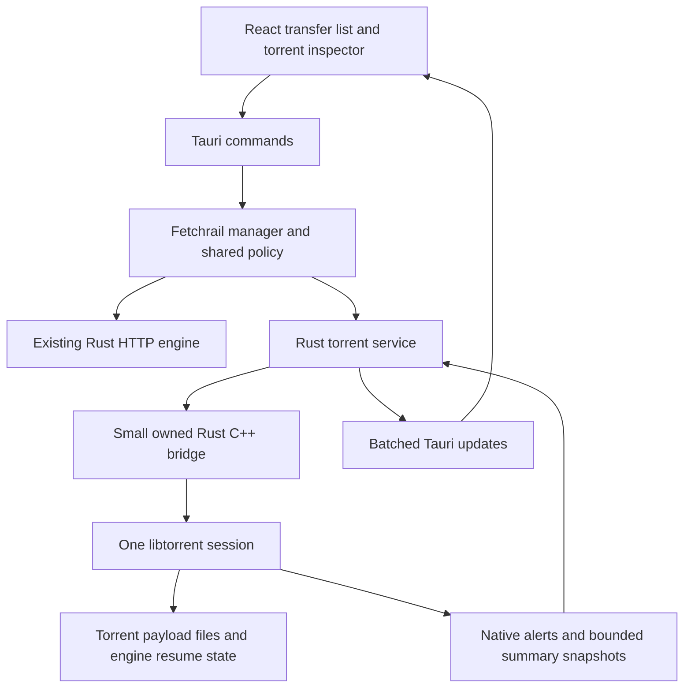

# Torrent support implementation plan

[← Back to the README](../README.md)

Research date: 9 October 2026. Status: native runtime and unified transfer UI implemented; performance and release qualification are recorded in [torrent validation](torrent-validation.md). The later automation and integration phases remain a roadmap.

Add **libtorrent rasterbar 2.1.2** as Fetchrail's native BitTorrent engine, accessed through a small Rust/C++ bridge. Keep the current HTTP engine and present both transfer types in the existing React interface. Deliver reliable magnet and `.torrent` transfers first, then the controls, automation, and integrations needed for a capable everyday torrent client.

The engine choice prioritizes protocol coverage and mature torrent behavior. Performance must be demonstrated on Windows against qBittorrent under matched conditions. Using the same engine does not establish equal speed by itself.

## Engine selection

| Candidate | Fit for Fetchrail | Decision |
| --- | --- | --- |
| **libtorrent rasterbar** | Native C++; broad torrent protocol coverage; requires an MSVC build and a Rust bridge. qBittorrent uses this engine. | Recommended. Start with the current stable 2.1.2 release and pin the exact source and dependency versions. |
| **librqbit / rqbit 9.0.1** | Direct Rust integration, existing Tauri application, useful streaming and resume support. Its stable README describes sequential downloading as the only piece-selection mode and does not advertise BEP 52. | Best Rust alternative, but a less direct route to the requested client controls. Treat v2 support as unverified, rather than asserting it is absent. |
| **qBittorrent controlled through its API** | Exposes many existing client features with less application logic to build. Requires managing another application, its state, authentication, and distribution. | Consider only if the product changes to a frontend for an existing torrent client. |
| **aria2** | Supports BitTorrent and RPC alongside other download protocols, as described in its [manual](https://aria2.github.io/manual/en/html/aria2c.html). Adds another process or integration boundary. | Useful comparison/reference; does not justify replacing the HTTP engine or become the default choice for this feature. |

The upstream release pages identify [libtorrent 2.1.2](https://github.com/arvidn/libtorrent/releases/tag/v2.1.2) as the latest stable release and [rqbit 9.0.1](https://github.com/ikatson/rqbit/releases/tag/v9.0.1) as rqbit's latest. libtorrent also maintains a [2.0.15 release](https://github.com/arvidn/libtorrent/releases/tag/v2.0.15); retain that branch as a fallback to evaluate if the Windows spike finds a reproducible 2.1 regression.

libtorrent supports v1, v2 and hybrid torrents, magnet metadata, DHT, PEX, local discovery, trackers, web seeds, private torrents, and fast resume. Its network and disk work run asynchronously. See the [official feature documentation](https://libtorrent.org/features-ref.html). qBittorrent confirms its engine choice and lists the broader client features in its [official overview](https://www.qbittorrent.org/).

For the Rust alternative, use the [versioned rqbit README](https://github.com/ikatson/rqbit/blob/v9.0.1/README.md), rather than assuming development-branch functionality ships in 9.0.1. [Encryption request 617](https://github.com/ikatson/rqbit/issues/617) and [file relocation request 599](https://github.com/ikatson/rqbit/issues/599) remain open; relocation has a linked development commit, so reassess it if considering a later release. rqbit's published speed reports are anecdotal, not a controlled comparison with Fetchrail.

Use libtorrent's [upstream license](https://github.com/arvidn/libtorrent/blob/v2.1.2/LICENSE) and dependency notices in the packaged application. The published [Rust libtorrent crate API](https://docs.rs/libtorrent/latest/libtorrent/) exposes only a small surface; do not assume an off-the-shelf Rust binding covers this plan. Prove required API coverage during the spike.

## What changes in this app

The current architecture offers useful shared behavior, but several models assume one HTTP URL produces one completed file.

| Existing area | Required change |
| --- | --- |
| `src-tauri/src/model.rs` | Add a defaulted transfer-kind field and torrent summary, including both possible info hashes. Separate payload completion from seeding state. Old records deserialize as HTTP. |
| `src-tauri/src/engine.rs` | Keep HTTP probing, segments, validators and merging. Dispatch common operations to the appropriate engine. Share queue admission and bandwidth policy. |
| `src-tauri/src/rate_limit.rs` | Retain HTTP token buckets; introduce coordinated engine budgets for the global download limit. |
| `src-tauri/src/lib.rs` | Register torrent commands, bounded events, startup argument ingestion, and graceful torrent shutdown before quit/update. |
| `src/App.tsx` and `src/App.css` | Reuse the shell, appearance tokens and row controls. Add torrent-aware rows, filters, import confirmation and an inspector. Extract shared transfer types when extending them. |
| `src/DownloadProgress.tsx` and `src-tauri/src/download_window.rs` | Display torrent files/peers instead of HTTP segments, and handle payload-ready notifications separately from seeding completion. |
| `src-tauri/src/native_protocol.rs`, `browser_bridge.rs`, and extension routing | Introduce explicitly validated torrent handoffs. The current browser protocol rejects schemes other than HTTP(S). |
| `src-tauri/src/install.rs` | Register optional magnet and `.torrent` associations, preserve user-selected defaults, and remove only Fetchrail-owned registrations. |
| `src-tauri/build.rs`, `Cargo.toml`, release workflow and packaging checks | Reproducibly build/link the native engine; test clean-machine installation, updating and removal. |

New implementation areas should stay small: `torrent/` for the bridge and torrent service, `transfer_policy.rs` for common admission/budgets if that logic no longer fits the manager, and React torrent components for import and inspection. Avoid a general plugin framework or multiple interchangeable torrent engines in the first implementation.

## Runtime architecture

**Start with an in-process, statically linked engine.** This fits Fetchrail's current single-executable installer and updater. The tradeoff is that a native crash can terminate the app. Move to a private helper process only if the spike identifies a concrete isolation or packaging requirement; do not introduce a helper solely as a hypothetical precaution.

The bridge owns the session and torrent handles. Rust receives owned values and opaque IDs, never borrowed native pointers. Catch C++ exceptions at every boundary; Rust panics must not unwind through C++. Keep blocking bridge calls off Tauri's UI thread and Tokio worker threads. One dedicated worker drains alerts, copies required data before alert lifetimes expire, and sends bounded Rust messages. The [libtorrent manual](https://libtorrent.org/manual-ref.html) describes its session, alert and resume-data lifecycle.

Initialize the session when torrent import or restored torrent work needs it. An HTTP-only installation should incur no torrent discovery, sockets or telemetry work.

Expose only the required operations: inspect/add, start/stop, remove, file priorities, limits, trackers, peers, recheck, relocate/rename, metadata export, and resume-state save/load. Extend that bridge when later features need it. Use request IDs and completion/error events for asynchronous operations; a successful command submission is not proof that a move or removal finished.

Build with matching x64 MSVC ABI/runtime settings and release optimization. Pin CMake, libtorrent, Boost, and the selected TLS/crypto dependencies; cache artifacts by those versions and compiler settings. Validate HTTPS tracker certificate trust on a clean Windows installation. Disable unused optional transports unless they are part of the tested support matrix. Follow the [current release CMake configuration](https://github.com/arvidn/libtorrent/blob/v2.1.2/CMakeLists.txt), because older build-guide examples are not a suitable toolchain recipe.

## Import and transfer lifecycle

### Adding a torrent

Support paste/batch paste of magnets, local `.torrent` files, HTTP(S) URLs that return torrent metadata, file drag-and-drop, Windows associations, and explicit browser companion handoff. Metadata URL fetches can reuse Fetchrail's validated HTTP/session handling, but browser cookies must never be passed to arbitrary trackers or web seeds.

Give browser handoff a versioned torrent request with strict size/item limits and an explicit sender allowlist. Web pages may submit a validated magnet/metadata URL or bounded torrent bytes; they cannot choose arbitrary local filesystem paths or call management commands. Parse quoted Windows launch arguments as data and queue imports until the manager is ready, including second-instance launches.

1. Classify and validate the input in Rust. A URL ending in `.torrent` is a hint, not proof; inspect bounded bytes before selecting torrent handling.
2. Resolve magnet metadata in a temporary import job. Retrieve metadata without writing payload files or starting content downloads/uploads; make cancellation and timeout/retry visible. This step contacts peers, so disclose it in the import state.
3. Show the file tree, total/selected size, free space, destination, queue/category, start mode, and seeding policy. Hide native pad files from ordinary selection.
4. Commit an immutable prepared-import token with the chosen options. Reuse the resolved metadata when adding the real torrent. Import cancellation must remove the temporary handle.
5. Detect duplicates by v1 and v2 hashes, including hybrid aliases. Select the existing item and offer deliberate tracker/file-selection updates instead of starting a duplicate swarm job. Do not merge trackers into private torrents automatically.

Unknown magnet size is shown as “Retrieving torrent information”; it is never a misleading zero-byte download. Metadata-only work gets its own small concurrency cap, so pasted magnet batches cannot exhaust the application's transfer slots.

### States and completion

Use common states where possible, adding `resolvingMetadata`, `checking`, `stalled`, `moving`, and `seeding`. Keep `finishedAt` as the time selected payload became ready, and add explicit payload-ready and seeding-finished information. A torrent with deselected files may have all wanted content ready while it cannot seed the entire torrent; display “Selected files downloaded” accurately and retain partial sharing where allowed.

Count jobs with all wanted payload ready against the sharing admission limit even when the engine does not report full-torrent seeding. This prevents partial-download sharing from occupying download slots indefinitely; label it as partial sharing in the inspector.

Separate the user's desired state from observed engine activity. A temporary network failure must not overwrite a deliberate pause or queue restriction. Restoring a session must preserve explicit user choices; initially recover interrupted work paused, matching Fetchrail's current behavior. Offer an explicit setting to resume previously running torrents at launch.

Default proposed seeding policy: continue sharing after selected files are ready; pause when ratio 1.0 **or** 24 hours of active post-download sharing is reached, whichever occurs first. Display this choice in import confirmation. Offer unlimited sharing and per-torrent overrides, including ratio, total time and inactive time. A private tracker's requirements can exceed this default; let users retain an unlimited policy.

Pause stops torrent payload download and upload. Remove normally keeps payload files; “Remove and delete files” is separate. Stopping seeding never deletes downloaded content. Payload-ready notifications fire once per completion transition, with durable deduplication through restart. Exit/shutdown completion actions default to waiting for the configured sharing policy and all relevant jobs; require an explicit payload-ready trigger to end sharing early.

### Storage and persistence

Write torrent payload directly into its chosen root through libtorrent. Do not run it through Fetchrail's HTTP part-directory merge pipeline. Keep all files of a multi-file torrent together; category changes move the torrent root through an engine operation instead of scattering files by extension.

Store a versioned torrent catalog, metadata, and per-torrent resume files under the existing application-data identity. Keep HTTP history compatible. Persist names, priorities, trackers, limits, sharing policy, queue order, cumulative counters and desired state. The catalog owns application intent; libtorrent resume data owns verified piece state. Validate that their IDs, hashes and storage paths agree before restoring.

Use atomic replace/backup for catalog and resume writes. Checkpoint changed torrents periodically, then on pause, metadata availability, file-priority changes, payload completion, relocation, removal and orderly exit. Drain save-resume alerts before confirming shutdown; report a bounded save failure without hanging indefinitely. Missing or incompatible resume data falls back to engine verification, not an assumed complete state.

Validate destination containment, drive roots, UNC paths, path traversal, reparse points/symlinks, reserved Windows names, long paths and case-insensitive collisions. Fail safely on ambiguous conflicts; do not silently rename torrent content behind the engine. Relocation and deletion must wait for engine file handles to close and act only on the managed payload set. Test missing files, disk full and cross-volume moves.

## Feature scope and release stages

This is the proposed Fetchrail scope. The baseline includes the familiar controls documented in [qBittorrent's client overview](https://www.qbittorrent.org/) and its [current WebUI API](https://github.com/qbittorrent/qBittorrent/wiki/WebUI-API-%28qBittorrent-5.0%29). Engine support supplies protocol mechanics; Fetchrail still has to implement the UI, persistence and policies for each exposed feature.

| Capability | Stage | Required behavior |
| --- | --- | --- |
| Magnets, local/remote `.torrent`, batches | Foundation | Metadata-first confirmation, cancellation, safe destinations, duplicate hashes. |
| v1, v2, hybrid torrents | Foundation | Correct import, verification and interoperability for all three. |
| DHT, PEX, local discovery, HTTP(S)/UDP trackers, TCP/uTP, IPv6, web seeds | Foundation | Tested discovery/transport settings and useful connection errors. |
| Private torrents | Foundation | Enforce tracker restrictions and disable prohibited discovery automatically. |
| Download, upload, pause, resume, remove, keep/delete payload | Foundation | Clear state, correct piece verification, safe deletion and restart. |
| File tree, deselection and file priorities | Client controls | Skip/low/normal/high; folder bulk actions; change selection during transfer. |
| Global and per-torrent download/upload limits | Client controls | Live changes, shared HTTP/torrent download budget, truthful units. |
| Queue order, force start, download/seed/check limits | Client controls | One admission policy; explicit exceptions; no scheduler races. |
| Share ratio, total/inactive sharing time | Client controls | Persistent limits, pause action, per-torrent overrides. |
| Overview, files, peers, trackers, pieces and activity details | Client controls | Bounded updates; distinguish connected peers from tracker swarm estimates. |
| Tracker editing/reannounce; peer add/ban | Client controls | Per-torrent operations; private tracker credentials redacted in UI/logs. |
| Recheck, set location, rename files/folders | Client controls | Engine-confirmed completion, no overwrite, errors recoverable. |
| Categories, tags, completed/incomplete folders | Client controls | Root-level placement and explicit automatic-move rules. |
| Sequential and first/last-piece priorities | Client controls | Optional modes; normal swarm piece selection remains the default. |
| Magnet/metadata export, open folder/files, bulk controls | Client controls | v1/v2-aware export; open only when selected content is ready. |
| Network interface binding, proxies, IP filtering, encryption | Client controls | Clearly scoped routing controls; verify fail-closed behavior before claiming VPN protection. |
| Listen port, UPnP/NAT-PMP and reachability | Client controls | Opt-in automatic mapping; report mapped versus actually reachable separately. |
| Super-seeding and advanced connections/disk settings | Client controls | Expose engine-supported settings with conservative defaults. |
| Windows associations and browser handoff | Desktop integration | Correct first/second launch arguments and authenticated explicit handoff. |
| Watch folders, clipboard detection | Desktop integration | Opt-in; bounded scanning, deduplication and stable-file detection. |
| Recurring bandwidth calendar and alternative speed profile | Desktop integration | Shared policy with full-speed, limited, paused and seed-only periods. |
| Notifications and completion actions | Desktop integration | Separate payload-ready and sharing-finished triggers. |
| Torrent creator | Advanced features | v1/v2/hybrid creation, trackers, private flag, cancel/progress, optional seed-after-create. |
| RSS feeds and automatic rules | Advanced features | Match previews, categories/tags, duplicate prevention, bounded parser and refresh. |
| Search providers | Advanced features | Provider isolation and clear permissions; do not execute arbitrary provider code in the engine. |
| Remote control/API | Advanced features | Opt-in authentication, loopback by default, origin protection; independently versioned API. |
| Streaming preview | Advanced features | Seek-aware piece priorities, authenticated local ranges, codec/player handling and cancellation. Sequential download alone is not a streaming feature. |
| Existing-client migration | Advanced features | Import metadata, paths and tags; verify local data before sharing. Do not assume resume formats are compatible. |

Do not call the foundation release “full qBittorrent parity.” Client controls and desktop integration are the normal-client release gate. The advanced stage completes the broader requested feature set; search, RSS and streaming need application work beyond selecting a torrent engine.

## UI design

Preserve Fetchrail's existing charcoal/light surfaces, Geist typography, ember/azure/jade/iris accents, restrained borders, and compact transfer rows.

- **Unified list:** HTTP and torrents remain in All downloads. Add Torrents, Seeding and Paused filters; protocol type remains visible. Seeding items also appear in Completed when their selected payload is ready. Counts follow those meanings consistently.
- **Torrent row:** name, selected-size progress, state, download/upload speeds, ETA, peer count and ratio. Keep secondary metrics in a compact subtitle or optional columns; existing HTTP rows retain their connection details. At narrow widths, move upload, ratio and peers into the inspector.
- **Inspector:** select a row to open Overview, Files, Peers, Trackers and Activity tabs. A bottom inspector fits the current wide transfer list; a dedicated torrent workspace may use a side inspector. Reuse the independent progress window with torrent-aware tabs.
- **Overview:** selected bytes, downloaded/uploaded totals, ratio and goal, availability, active/seed time, hashes, source, destination, and connection diagnosis.
- **Files:** accessible hierarchical checkboxes, size/progress/priority, folder selection, select all/none and filename search. Virtualize large trees. Missing/unwanted files do not count as selected progress.
- **Peers/trackers:** on-demand tables with sorting, useful status/errors and deliberate management actions. IP details stay in the inspector. Tracker scrape counts are estimates, not a claim about currently connected peers.
- **Import:** the main field accepts links or magnets; an Open torrent control and drag target accept files. Resolve metadata, then show selection and storage before start. Advanced network controls belong in Torrent settings, not the ordinary add flow.
- **Settings:** group bandwidth/sharing, connectivity, privacy/routing, storage and automation. Use the existing theme/accent settings throughout.

Stalled, blocked by queue, unreachable tracker, checking and disk-full states need distinct captions and recovery actions. Avoid indefinite “Connecting” for every problem. Use keyboard navigation, text plus color for status, screen-reader labels, reduced-motion support, and accessible dark/light contrast. Progress should count verified wanted payload; ETA is unknown during metadata resolution, verification, or an unavailable swarm.

## Performance and shared policies

### Keep native throughput out of the UI

Let libtorrent handle peer selection, hashing and storage; do not relay blocks through JavaScript or add a second payload copy. Begin with its shipping defaults, then measure SSD and HDD behavior before tuning buffers, file handles, connection counts or disk backends. The [upstream tuning guide](https://libtorrent.org/tuning-ref.html) explains the tradeoffs; maximum peers and larger caches are not universally faster.

Emit changed summaries in batches at roughly 4 Hz while the UI is visible, with immediate structural/status/error updates. Fetch peer, tracker and file-detail snapshots only for an open inspector at about 1 Hz. Coalesce stale telemetry, cap alert queues, and fetch a fresh snapshot after overflow. Persist state on meaningful changes/checkpoints, not every speed sample. Virtualize long lists, trees and peer tables after the fixture demonstrates the need.

### One queue policy

Fetchrail owns queue windows, priority and admission across both engines. Disable competing libtorrent auto-management for app-managed handles. Keep independent caps for payload downloads, seeds, metadata jobs and checking. Sharing does not consume a payload download slot; verification gets a disk-work cap. A paused/closed queue blocks its torrent payload upload as well as download unless its explicit schedule is seed-only. “Force start” can bypass ordinary admission/order but must still obey user pause, bandwidth and routing protections.

### One global download budget

Giving the full global cap independently to HTTP and libtorrent would allow approximately twice the configured rate. Add a small budget broker that assigns HTTP and torrent-session budgets whose sum stays within the global limit, redistributing unused allocation at bounded intervals. Apply the HTTP portion to the existing shared limiter and the torrent portion to libtorrent's native session limit; per-job limits remain additional ceilings. Use smoothing and hysteresis so idle capacity can be reclaimed without oscillation or starvation.

Engine limit value `0` often means unlimited. A zero budget allocation must suspend payload admission or use an explicit disabled state, not pass `0` and accidentally remove throttling. Measure sustained aggregate payload throughput and known buffering bursts. The UI should describe a payload-rate limit honestly; it is not a promise to count every network protocol byte. Upload gets a separate global torrent budget.

### Connectivity and private torrents

Use libtorrent's discovery and routing configuration, with public/private torrent rules preserved. [BEP 27](https://www.bittorrent.org/beps/bep_0027.html) requires private torrents to restrict peer discovery and tracker behavior. Do not append public trackers to private jobs.

Interface/proxy support must cover TCP peers, uTP, trackers, web seeds, DHT and DNS for the selected mode. Verify Windows IPv4/IPv6 adapter changes and reconnect behavior with packet capture. If a selected adapter disappears, pause and prevent fallback. A SOCKS setting or peer encryption label alone does not prove all traffic uses a VPN or proxy. Retain SSRF mitigation, TLS validation and bounded metadata parsing; expose no unauthenticated engine management server. See the [engine settings reference](https://libtorrent.org/reference-Settings.html).

## Delivery milestones

| Milestone | Deliverable | Exit condition |
| --- | --- | --- |
| **Engine spike** | Build/link pinned 2.1.2 on Windows; minimal bridge and isolated fixture. | Real v1/v2/hybrid transfer, file priorities, pause/resume, resume-data restore, HTTPS trust, clean packaged startup, and acceptable benchmark results. Resolve bridge/ABI/runtime risk before a large UI investment. |
| **Foundation** | Import, torrent service/catalog, state machine, direct storage and unified basic rows. | Correct output, duplicates, metadata cancellation, crash recovery, deselection and safe removal in isolated tests. |
| **Client controls** | Sharing limits, budget broker, queue policy, inspector and network/storage controls. | Every client-control row above has an acceptance fixture; no HTTP scheduling/limiting regressions. |
| **Desktop integration** | Associations, browser handoff, progress windows, recurring schedules, watch folder and notifications. | Clean-machine install/update/uninstall and first/second-launch tests; coherent combined HTTP/torrent UI in every appearance mode. First normal-client release. |
| **Advanced features** | Creator, RSS, search, remote API, streaming and migration. | Each feature has its own bounded inputs, cancellation, persistence and end-to-end tests. Complete the broader feature scope. |

Planning allowance for one experienced developer: approximately **5–8 engineering weeks** through desktop integration, with advanced features adding roughly **2–4 weeks**. This is a scope estimate, not a delivery commitment; recalibrate after the engine spike and the first performance measurements.

## Acceptance tests and benchmarks

All performance figures below are **proposed acceptance targets**, not measurements or claimed engine guarantees.

| Area | Fixture and pass criterion |
| --- | --- |
| Correctness | Local deterministic swarms for v1/v2/hybrid, single/multi-file, Unicode/long paths, deselection and corrupt pieces. Verify final SHA-256 for every selected file and successful upload to an independent client. |
| Speed | Fixed seeders, same payload, hardware, connection/rate caps, transport, cache state and libtorrent version where possible. Alternate Fetchrail/qBittorrent order, run at least three times, record medians/spread. Target at least 95% of qBittorrent payload throughput with no correctness difference. |
| Disk and CPU | Repeat on SSD and HDD; include large files, thousands of small files, verification and mixed HTTP/torrent load. Record CPU, private bytes, working set, mapped-file memory, disk traffic and peak commit. Target under 10% bridge/telemetry CPU overhead relative to an equivalent native-engine fixture. |
| UI responsiveness | 1,000 catalog entries plus a 10,000-file tree and large peer table. Target p95 action feedback below 100 ms and no repeated main-thread stalls above 50 ms. Native pause acknowledgment should arrive within one second under ordinary load, excluding blocked disk flush. |
| Event bounds | No per-peer/per-block frontend events. Target at most four routine summary batches per second; immediate status transitions are exempt. Hidden/closed detail views stop detail polling. |
| Resume | Graceful restart, hard kill during writes, corrupt/missing checkpoints, moved/modified files. No false completion; valid unchanged data uses fast resume when accepted by the engine, invalid state rechecks. |
| Bandwidth | HTTP-only, torrent-only and mixed work; live global/per-job changes and zero allocations. After warm-up, 60-second aggregate payload averages stay within 5% of the configured cap; document bounded startup bursts. No starvation when both groups have demand. |
| Sharing and queues | Ratio/time/inactive limits, no interested peers, private jobs, selected-file-only jobs, queue closure, seed-only windows, manual pause, force-start and restart. Counters and notifications persist; no unrequested transfers. |
| Connectivity | Deterministic HTTP/UDP trackers and private fixtures in CI. Manual controlled DHT/uTP/IPv6/NAT/router tests; distinguish mapping from external reachability. Adapter/proxy failure tests inspect packets, including DNS and IPv6. |
| Filesystem safety | Traversal, reserved names, collisions, symlinks/reparse points, disk-full, destination loss, failed/cross-volume relocation, removal with shared/unrelated files. No overwrite or deletion outside the managed payload. |
| Installation | Paths with spaces, per-user registration, existing/absent associations, background launch, already-running app, signed update and removal. No orphan associations or lost download state. |

Keep CI independent of public swarm availability: fixture seeders/trackers should start locally with isolated ports and test-only application data. Use separate controlled WAN/router sessions for interoperability and real-world throughput; public Linux distribution torrents are useful smoke tests but cannot produce a fair repeatable speed ranking.

Retain the existing frontend, Rust, HTTP-engine, browser and setup checks. Add torrent integration tests and a reproducible benchmark runner to the established scripts workflow. The final release gate is correct files, stable state, honest bandwidth behavior, responsive UI, and installed-app recovery—not merely a successful magnet download.
